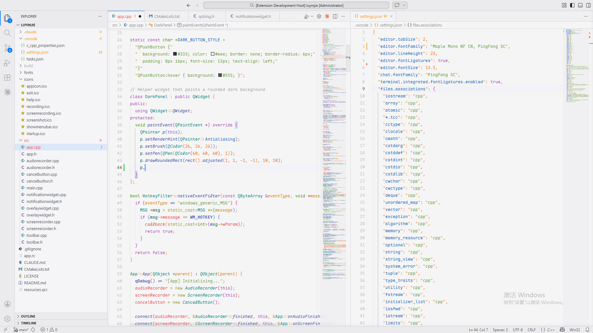
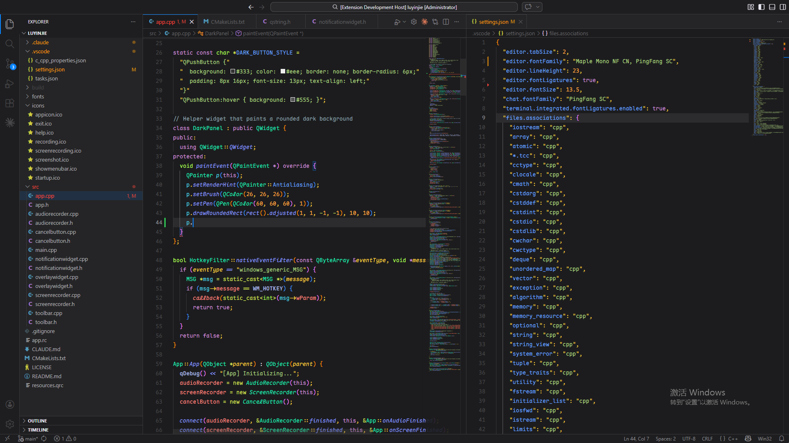

# Haokee Theme / 渴鹅主题

一款优雅的 VS Code 主题。UI 为类 macOS 风格，着色为自配颜色。搭配 Maple Mono 字体使用甚佳。针对 C++ 进行了特调优化。

An elegant VS Code theme. The UI follows a macOS-inspired style with a custom color palette. Works beautifully with the Maple Mono font. Specially tuned and optimized for C++.

- **白色 / Light**：如同白玉般温润光滑，低调中透露一丝奢华。糖果版五颜六色的着色在你细细咀嚼代码是能够品尝出一丝甜意。
  Smooth and lustrous like white jade — understated yet subtly luxurious. The candy-colored syntax highlighting adds a touch of sweetness as you savor your code.
- **黑色 / Dark**：简朴而又深邃。夜空中，不同的颜色的亮堂着色仿佛像悬挂着的星空，用不同颜色闪耀着你的代码。
  Simple yet profound. Against the night sky, the vivid, varied colors light up your code like stars scattered across the heavens.

<table>
  <tr>
    <td align="center"> Haokee Light 主题</td>
    <td align="center"> Haokee Dark 主题</td>
  </tr>
</table>

## About Me / 作者

我是好渴鹅，[个人主页](https://note.haokee.org/)，欢迎通过邮件 haokee114@gmail.com 联系我。

I'm Haokee. Visit my [personal site](https://note.haokee.org/) or reach me by email at haokee114@gmail.com.
